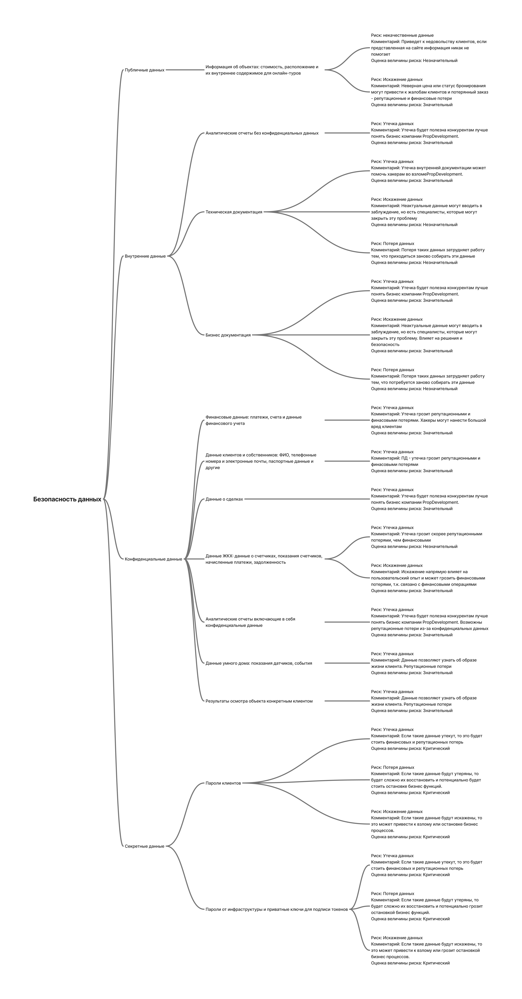

# Задание 1. Разработка проверочного листа по безопасности данных

Первым делом нужно разработать проверочный лист по безопасности данных. Сейчас это ключевая проблема компании и самое уязвимое место.

Чтобы создать документ, выполните четыре шага.

1. **Проанализируйте диаграмму и описание системы PropDevelopment**

Классифицируйте типы данных, с которыми работает компания, по стандартам ISO/IEC 27001 и 27002. Распределите их по четырём категориям:

- публичные данные,
- внутренние данные,
- конфиденциальные данные,
- секретные данные.

2. **Определите риски для каждой категории данных**

В каждой категории данных могут существовать следующие риски:

- утечка данных,
- потеря данных,
- искажение данных,
- некачественные данные,
- обесценивание данных.

3. **Объясните, почему именно этот риск актуален для указанной категории данных**
4. **Дайте оценку каждому риску**

В качестве шкалы используйте категории «незначительный-значительный-критический».

5. **Визуализируйте результаты анализа в виде mindmap**

Для создания mindmap используйте draw.io. В центре разместите блок «Безопасность данных». От него протяните стрелочки и разместите следующий уровень — выделенные категории данных. На следующем уровне укажите, какие именно данные компании относятся к этой категории. Для каждого типа данных укажите риск и присвойте ему оценку. На последнем уровне объясните, почему вы оценили риск именно так.

Когда mindmap будет готов, загрузите его в директорию **Task1** вашего репозитория.

# Решение

## Типы данных
Публичные данные:
- Информация об объектах: стоимость, расположение и их внутреннее содержимое для онлайн-туров

Внутренние данные:
- Аналитические отчеты без конфиденциальных данных
- Техническая документация
- Бизнес документация

Конфиденциальные данные:
- Финансовые данные: платежи, счета и данные финансового учета
- Данные клиентов и собственников: ФИО, телефонные номера и электронные почты, паспортные данные и другие
- Данные о сделках
- Данные ЖКХ: данные о счетчиках, показания счетчиков, начисленные платежи, задолженность
- Аналитические отчеты включающие в себя конфиденциальные данные
- Данные умного дома: показания датчиков, события
- Результаты осмотра объекта конкретным клиентом

Секретные данные:
- Пароли 
- Приватные ключи для подписи токенов

## Риски по категориям данных
- утечка данных,
- потеря данных,
- искажение данных,
- некачественные данные,
- обесценивание данных.

**Публичные данные**
Риск: Некачественные данные
Комментарий: Приведет к недовольству клиентов, если представленная на сайте информация никак не помогает
Оценка величины риска: Значительный

Риск: Искажение данных
Комментарий: Неверная цена или статус бронирования могут привести к жалобам клиентов и потерянный заказ - репутационные и финансовые потери
Оценка величины риска: Значительный

**Внутренние данные:**
Риск: Утечка данных
Комментарий: Утечка внутренней документации может помочь хакерам во взломе, а аналитика будет полезна конкурентам лучше понять бизнес компании PropDevelopment. 
Оценка величины риска: Значительный

Риск: Искажение данных
Комментарий: Неактуальные данные могут вводить в заблуждение, но есть специалисты, которые могут закрыть эту проблему
Оценка величины риска: Незначительный

Риск: Потеря данных
Комментарий: Потеря таких данных затрудняет работу тем, что приходиться заново собирать эти данные
Оценка величины риска: Незначительный

**Конфиденциальные данные:**
Риск: Потеря данных
Комментарий: Если мы потеряем такие данные, то нам будет крайне сложно восстановить их без последствий. Вероятнее всего будут репутационные и финансовые потери
Оценка величины риска: Критический

Риск: Утечка данных
Комментарий: Если такие данные утекут, то это будет стоить финансовых и репутационных потерь
Оценка величины риска: Критический

Риск: Искажение данных
Комментарий: Нельзя в личном кабинете показывать данные другого клиента. Эти данные также нельзя менять через стороннее API
Оценка величины риска: Критический

**Секретные данные:**
Риск: Утечка данных
Комментарий: Если такие данные утекут, то это будет стоить финансовых и репутационных потерь
Оценка величины риска: Критический

Риск: Потеря данных
Комментарий: Если такие данные будут утеряны, то будет сложно их восстановить и потенциально будет стоить остановке бизнес функций.
Оценка величины риска: Критический

Риск: Искажение данных
Комментарий: Если такие данные будут искажены, то это может привести к взлому или остановке бизнес процессов.
Оценка величины риска: Критический

## Mindmap
